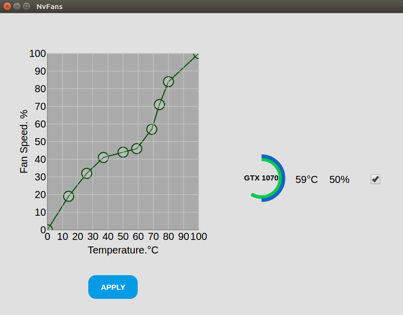

# NvFans

> A simple linux desktop application that can control nvidia GPU fan speed by temperature.

## Tech
- `Electron.js` for application framework
    - `Node.js` for programming logic
    - `D3.js` and `Snap.svg` for front-end graphics

## Screenshot


## Usage
- Requirement:
    - Node.js 7.8.0 or newer
    - electron 1.6.11 or newer

```
cd electronAPP
electron main.js
```
- You can adjust fan speed by dragging the line on the chart
- Hold shift key and click on the chart to add new point
- Press `del` to delete a chosen point
- Check/Uncheck to activate/deactivate each cards speed control
- up to 6 cards support for now

## License
The MIT License

Copyright (c) 2017 Kirintw

See the LICENSE file for details.
